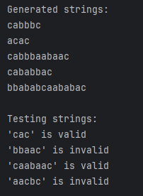

# The title of the work

### Course: Formal Languages & Finite Automata
### Author: Gurev Andreea

----

## Theory
A formal language is a set of strings made from symbols in a finite alphabet, defined by rules called a grammar. Grammars are categorized into four types (Chomsky hierarchy). 

A finite automaton (FA) is a simple machine that processes strings and decides whether they belong to a language. It has states, transitions, a start state, and accept states.

Finite automata and regular grammars are equivalent: any regular grammar can be converted into a finite automaton, and vice versa. This makes FAs essential for tasks like pattern matching, lexical analysis, and designing compilers.

## Objectives:

* Discover what a language is and what it needs to have in order to be considered a formal one;
* Provide the initial setup for the evolving project that I will work on during this semester.
* Get the grammar definition and develop a code that implements a grammar class capable of generating valid strings and converting to a finite automaton with string validation functionality.

## Implementation description

### Grammar Class
* Initialization of the grammar with non-terminals (VN), terminals (VT), production rules (P), and a start symbol (S). The rules define how symbols can be replaced to generate strings.

```
    def __init__(self):
        self.VN = {'S', 'A', 'B'}
        self.VT = {'a', 'b', 'c'}
        self.P = {
            'S': ['aS', 'bS', 'cA'],
            'A': ['aB'],
            'B': ['aB', 'bB', 'c']
        }
        self.start_symbol = 'S'
```
* generate_strings implementation generates valid strings by recursively applying production rules. It ensures uniqueness and limits string length to 15 characters.
```
    def generate_strings(self, n=5):
        def derive(symbol):
            if symbol in self.VT:
                return symbol
            production = random.choice(self.P[symbol])
            return ''.join(derive(s) for s in production)

        valid_strings = set()
        while len(valid_strings) < n:
            result = derive(self.start_symbol)
            if len(result) <= 15:
                valid_strings.add(result)
        return list(valid_strings)
```

* to_finite_automaton implementation converts the grammar into a finite automaton. It creates states for non-terminals, defines transitions based on production rules, and sets the start and accept states.
```
    def to_finite_automaton(self):
        states = {'q0', 'qf'} | {f'q_{nt}' for nt in self.VN}
        transitions = {state: {} for state in states}

        for nt, prods in self.P.items():
            current = f'q_{nt}'
            for prod in prods:
                next_state = f'q_{prod[1]}' if len(prod) > 1 and prod[1] in self.VN else 'qf'
                transitions[current][prod[0]] = next_state

        for prod in self.P['S']:
            next_state = f'q_{prod[1]}' if len(prod) > 1 and prod[1] in self.VN else 'qf'
            transitions['q0'][prod[0]] = next_state

        return FiniteAutomaton(states, self.VT, transitions, 'q0', {'qf'})
```

### FiniteAutomaton Class

* Initializes the automaton with states, an alphabet, transition rules, a start state, and accept states. These define how the automaton processes input strings.
```
    def __init__(self, states, alphabet, transitions, start_state, accept_states):
        self.states = states
        self.alphabet = alphabet
        self.transitions = transitions
        self.start_state = start_state
        self.accept_states = accept_states
```
* check_string implementation simulates the automaton by processing each symbol in the input string. It returns True if the string ends in an accept state, otherwise False.
```
    def check_string(self, input_string):
        current = self.start_state
        for symbol in input_string:
            if symbol not in self.alphabet or \
                    current not in self.transitions or \
                    symbol not in self.transitions[current]:
                return False
            current = self.transitions[current][symbol]
        return current in self.accept_states
```
### Main function
* Creates a Grammar object, generates 5 valid strings, converts the grammar to a finite automaton, and tests a list of strings for validity.
```
def main():
    grammar = Grammar()

    print("Generated strings:")
    for s in grammar.generate_strings(5):
        print(s)

    fa = grammar.to_finite_automaton()
    test_strings = ["cac", "bbaac", "caabaac", "aacbc"]

    print("\nTesting strings:")
    for s in test_strings:
        result = fa.check_string(s)
        print(f"'{s}' is {'valid' if result else 'invalid'}")
```


* Here is how the output looks like:




## Conclusions / Screenshots / Results
In this laboratory work, i've learned how to implement a formal grammar and a finite automaton to generate and validate strings within a defined language. This code shows a grammar converted it into a finite automaton, and tested it with sample strings to see if they fit the rules. After this laboratory the theory seems clearer to me and shows how practical this ideas are in real-word applications.

## References
1. Lecture notes from else