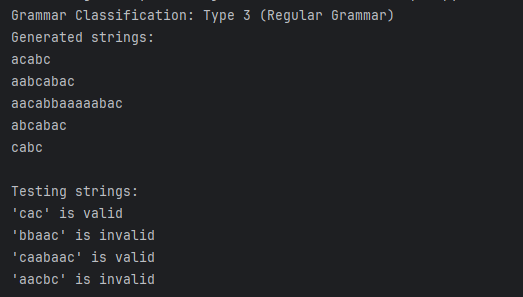
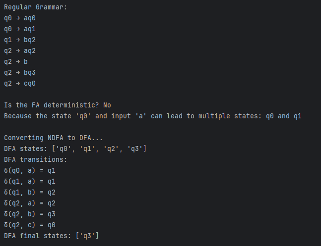
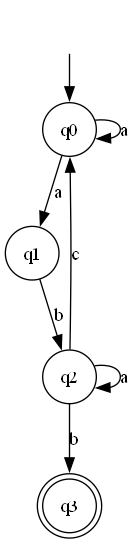
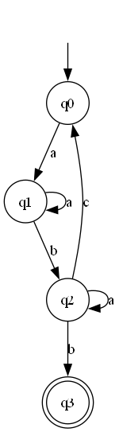

# The title of the work

### Course: Formal Languages & Finite Automata
### Author: Gurev Andreea FAF-231

----

## Theory
Finite automata are fundamental models used to represent various computational processes. They are commonly employed in 
computer science, artificial intelligence, and linguistics to analyze and design systems that follow predefined rules. 
The term finite indicates that the automaton has a limited number of states, and it always starts from an initial state 
and may reach one or more final states. Finite automata are particularly useful in recognizing patterns, parsing text, 
and verifying sequences of inputs. They can be visualized as state machines where transitions between states occur based 
on given inputs. These transitions define how the automaton reacts to different symbols, determining whether a particular 
sequence is accepted or rejected.

Automata can be classified as deterministic or non-deterministic, depending on their transition behavior. A deterministic 
finite automaton (DFA) has a predictable structure where each state-symbol pair leads to exactly one next state. This makes 
it easy to analyze and implement in real-world applications. However, in some cases, an automaton may have multiple possible 
transitions for the same symbol in a given state, leading to non-determinism. Such automata are called non-deterministic 
finite automata (NDFA). While NDFAs may seem more complex, they can be systematically converted into an equivalent DFA using 
a standard algorithm. This conversion is crucial because DFAs are more efficient in practical applications, such as designing 
compilers, search engines, and control systems.

Finite automata are also closely linked to formal grammars, particularly regular grammars, which describe the structure 
of languages in terms of production rules. The relationship between automata and grammars allows us to translate a finite 
automaton into an equivalent regular grammar, ensuring that both models describe the same language. This conversion helps 
in understanding how automata process strings and generate output sequences. The study of finite automata plays a crucial 
role in theoretical computer science, as it provides a foundation for more advanced computational models, such as pushdown 
automata and Turing machines, which are used to solve complex problems in programming languages and artificial intelligence.

## Objectives:

* Understand what an automaton is and what it can be used for;
* Continuing the work in the same repository and the same project, the following need to be added: 
* a. Provide a function in your grammar type/class that could classify the grammar based on Chomsky hierarchy.
b. For this you can use the variant from the previous lab.
* According to your variant number (by universal convention it is register ID), get the finite automaton definition and do the following tasks:
a. Implement conversion of a finite automaton to a regular grammar.
b. Determine whether your FA is deterministic or non-deterministic.
c. Implement some functionality that would convert an NDFA to a DFA.
d. Represent the finite automaton graphically (Optional, and can be considered as a bonus point):
You can use external libraries, tools or APIs to generate the figures/diagrams.
Your program needs to gather and send the data about the automaton and the lib/tool/API return the visual representation.

## Implementation description

The provided method classify_chomsky is designed to determine whether a given grammar is a right-regular or 
left-regular grammar, which are types of regular grammars in the Chomsky hierarchy. Regular grammars are used to describe 
regular languages, and they are a subset of context-free grammars.

The method checks if the grammar is either right-regular or left-regular by examining the structure of the production rules.

A grammar is right-regular if all productions are of one of the following forms:

A
→
a
A→a (a single terminal symbol).

A
→
a
B
A→aB (a terminal followed by a non-terminal).

A grammar is left-regular if all productions are of one of the following forms:

A
→
a
A→a (a single terminal symbol).

A
→
B
a
A→Ba (a non-terminal followed by a terminal).

```
    def classify_chomsky(self):
        is_right_regular = all(
            len(prod) <= 2 and (len(prod) == 1 and prod[0] in self.VT or
                                (len(prod) == 2 and prod[0] in self.VT and prod[1] in self.VN))
            for prods in self.P.values()
            for prod in prods
        )

        is_left_regular = all(
            len(prod) <= 2 and (len(prod) == 1 and prod[0] in self.VT or
                                (len(prod) == 2 and prod[0] in self.VN and prod[1] in self.VT))
            for prods in self.P.values()
            for prod in prods
        )
```
This method is_deterministic is designed to determine whether a given finite automaton (FA) is deterministic. 
A deterministic finite automaton (DFA) is a type of FA where, for each state and input symbol, there is exactly one transition 
to a next state. If there are multiple possible transitions for any state-symbol pair, the automaton is non-deterministic (NFA).

The method checks if the automaton is deterministic by ensuring that for every state and every input symbol, there is at most one transition.

If any state-symbol pair has more than one possible transition, the automaton is non-deterministic, and the method returns False.

If all state-symbol pairs have at most one transition, the automaton is deterministic, and the method returns True.
```
    def is_deterministic(self):
        for state in self.states:
            for symbol in self.alphabet:
                destinations = self.get_transitions(state, symbol)
                if len(destinations) > 1:
                    return False

        return True
```
The get_transitions method is a helper function designed to retrieve all possible destination states for a given state and input symbol in a finite automaton. This method is typically used in conjunction with 
other methods, such as the is_deterministic method, to analyze the behavior of the automaton.

The method iterates over all entries in the self.transitions dictionary.

For each entry, it checks if the state and symbol match the provided state and symbol.

If a match is found, it adds the corresponding destination state(s) to the destinations list.

The method handles cases where the destination is a single state or a list of states.

```
    def get_transitions(self, state, symbol):
        destinations = []
        for (s, sym), dest_states in self.transitions.items():
            if s == state and sym == symbol:
                if isinstance(dest_states, list):
                    destinations.extend(dest_states)
                else:
                    destinations.append(dest_states)
        return destinations
```
The to_regular_grammar method is designed to convert a finite automaton (FA) into a regular grammar. Regular grammars are 
used to generate regular languages and are closely related to finite automata. This method constructs a grammar from the transitions of the automaton, 
ensuring that the grammar is either right-regular or left-regular, depending on the structure of the automaton.

The method constructs a regular grammar by iterating over the transitions of the automaton.

For each transition, it generates production rules for the grammar.

If a transition leads to a final state, it generates both a terminal production and a non-terminal production.

If the start state is also a final state, it adds an epsilon (ε) production to the grammar.
```
    def to_regular_grammar(self):
        grammar = {}

        for (state, symbol), destinations in self.transitions.items():
            if state not in grammar:
                grammar[state] = []

            dest_list = destinations if isinstance(destinations, list) else [destinations]

            for dest in dest_list:
                if dest in self.final_states:
                    grammar[state].append(f"{symbol}")
                    grammar[state].append(f"{symbol}{dest}")
                else:
                    grammar[state].append(f"{symbol}{dest}")


        if self.start_state in self.final_states:
            if self.start_state not in grammar:
                grammar[self.start_state] = []
            grammar[self.start_state].append("ε")

        return grammar
```
The to_dfa method is designed to convert a non-deterministic finite automaton (NFA) into a deterministic finite automaton (DFA). 
This process is known as the subset construction or powerset construction. The method ensures that the resulting DFA is 
equivalent to the original NFA, meaning it accepts the same language.

The method first checks if the automaton is already deterministic using self.is_deterministic(). If it is, the method returns the automaton as-is.

If the automaton is non-deterministic, it performs the subset construction to create a DFA:

It initializes the DFA's states, transitions, and final states.

It processes each state in the DFA (which is a set of NFA states) and computes the transitions for each symbol in the alphabet.

It maps the resulting DFA states to simpler names (e.g., q0, q1, etc.) for readability.

It constructs and returns a new FiniteAutomaton object representing the DFA.

```
    def to_dfa(self):
        if self.is_deterministic():
            return self

        dfa_states = []
        dfa_transitions = {}
        dfa_final_states = []

        start_closure = frozenset([self.start_state])
        unprocessed_states = [start_closure]
        dfa_states.append(start_closure)

        while unprocessed_states:
            current_state = unprocessed_states.pop(0)

            for symbol in self.alphabet:
                next_state_set = set()


                for state in current_state:
                    next_states = self.get_transitions(state, symbol)
                    next_state_set.update(next_states)

                if not next_state_set:
                    continue

                next_state = frozenset(next_state_set)

                dfa_transitions[(current_state, symbol)] = next_state

                if next_state not in dfa_states:
                    dfa_states.append(next_state)
                    unprocessed_states.append(next_state)

        for state in dfa_states:
            if any(s in self.final_states for s in state):
                dfa_final_states.append(state)

        state_map = {state: f"q{i}" for i, state in enumerate(dfa_states)}

        new_transitions = {}
        for (state, symbol), next_state in dfa_transitions.items():
            new_transitions[(state_map[state], symbol)] = state_map[next_state]

        return FiniteAutomaton(
            states=[state_map[state] for state in dfa_states],
            alphabet=self.alphabet,
            transitions=new_transitions,
            start_state=state_map[dfa_states[0]],
            final_states=[state_map[state] for state in dfa_final_states]
        )
```
The visualize method is designed to generate a visual representation of a finite automaton (FA) using the Graphviz library. 
This method creates a directed graph where states are represented as nodes, and transitions are represented as edges 
labeled with input symbols. The graph can be rendered as an image (e.g., PNG, SVG) for visualization purposes.

The method uses the graphviz.Digraph class to create a directed graph.

It adds nodes for each state in the automaton, with final states represented as double circles and non-final states as single circles.

It adds an invisible node ('start') and an edge from this node to the start state to indicate the initial state.


```
    def visualize(self):
        dot = graphviz.Digraph(comment='Finite Automaton')

        for state in self.states:
            if state in self.final_states:
                dot.node(state, shape='doublecircle')
            else:
                dot.node(state, shape='circle')

        dot.node('start', style='invisible')
        dot.edge('start', self.start_state)

        for (state, symbol), destinations in self.transitions.items():
            if isinstance(destinations, list):
                for dest in destinations:
                    dot.edge(state, dest, label=symbol)
            else:
                dot.edge(state, destinations, label=symbol)

        return dot
```


* Here is how the output looks like:










## Conclusions / Screenshots / Results
In this lab, we explored finite automata and formal grammars, focusing on converting a non-deterministic finite automaton (
NDFA) into a deterministic finite automaton (DFA) and understanding the relationship between automata and regular grammars. 
We developed a program to define an NDFA, check whether it is deterministic or non-deterministic, and transform it into a 
DFA by merging states to eliminate uncertainty. Additionally, we converted the automaton into a regular grammar and 
classified it according to the Chomsky hierarchy to analyze its complexity.

This lab helped us understand how automata process languages and why DFAs are more efficient than NDFAs in real-world 
applications, such as search engines and compilers. By implementing these concepts, we gained a deeper insight into how 
computers recognize patterns and process inputs, which is crucial for future studies in programming and algorithms. 
Overall, this work reinforced the theoretical foundations of automata and grammars while highlighting their practical 
importance in computer science.
## References
1. Lecture notes from else
2. Graphviz Documentation: https://graphviz.readthedocs.io/